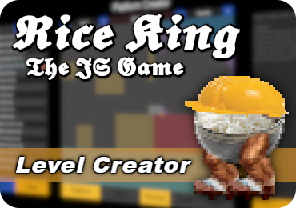

  

# Rice King

Platformer game inspired by other game named ***"Jump King"***.  

In Rice King you take control of a little `Rice Bowl`, destined to be devoured by the almighty `Rice God`.  
Climb up and stay determined little one, for your journey won't be easy.

I made Rice King as my very first JavaScript project, it helped me to understand JS in practice.  
Files and the code itself might look kinda messy but please bear in mind that it was my ***first*** project and I let it stay like this on purpose. In the future I simply would like to come back here and see the beginning of my programming journey and all the progress I made by all this time.  
 

>*I would also want to say thank you to my friend and mentor <a href="https://github.com/Ph0enixKM">***Ph0enix***</a> who believed in me and was my guide for the whole time.*  

 
<a href="https://github.com/xPiccolinox/RiceKingLevelCreator">

> `Also worth check out:`
>
> 

</a>
 

# Controls

> A - Left  
> D - Right  
> Space - Charge Jump  
> Esc - Menu

# DevMode

DevMode is an in-game tool made to make game testing easier  
> / - Turn DevMode ON / Off  
> < - Level Down  
> \> - Level Up  
> LMB - Teleport player to cursor's location  

# Game mechanics

> ## Basic movement 
>
> ### Moving
> Just walking  
>
>   
>
> ### Jumping  
>
> 
   

> ## More important mechanics
> 
> ### Collision detection - Makes you bounce off the walls or ceilings and allows you to walk on the floor
>
>   
> 
> ### Slopes - You just slide down ¯\\_(ツ)\_/¯
>
>   
> 
> ### Wind - Pushes you in its direction, the faster the wind the stronger the force
>
>   
> 
> ### Snow - When you stay in the snow, it prevents you from the wind's force
>
>   
> 
> ### Ice - *S l i p p e r y*
>
> 
 

> ## Other features
> - <a href="https://github.com/xPiccolinox/RiceKingLevelCreator">Rice King **Level Creator**</a>
> - Loading bar
> - Game menu with:
> - - Timer
> - - Current location
> - - Statistics
> - - Restart button
> - *F a n c y* &nbsp;animations
> - *E v e n &nbsp; f a n c i e r* &nbsp;fall animation:  
> 

  
***Hope you'll enjoy it, have fun B)***